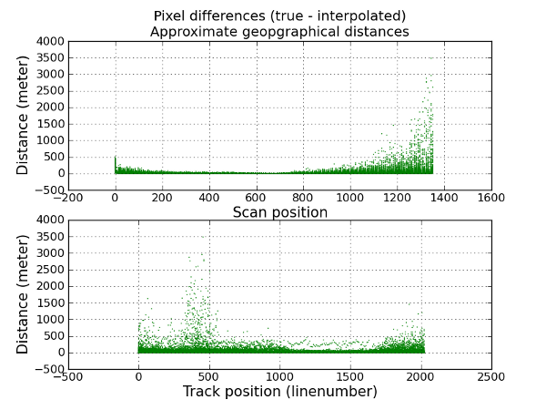
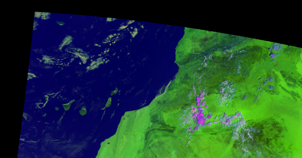

Python-geotiepoints
===================

Python-geotiepoints is an application for the interpolation (and extrapolation if
needed) of geographical tiepoints into a larger/denser geographical grid. This is usefull
when the full resolution lon/lat grid is needed while only a lower resolution
grid of tiepoints is available.

Some helper functions are provided to accomodate for satellite data, but the
package should be generic enough to be used for any kind of data.

The source code of the module can be found on the github_ page.

.. _github: http://github.com/adybbroe/python-geotiepoints

.. contents::

Installation - Pip
------------------

You can install the latest version of python-geotiepoints with pip::

   pip install python-geotiepoints

Alternatively, you can download the source code from github_::

   git clone git://github.com/adybbroe/python-geotiepoints.git

and then run::

   pip install .

Alternatively, to install the package in a "development" mode when you
want to edit the source code and see the effects::

   pip install -e .

Installation - Conda
--------------------

The python-geotiepoints package is also available on conda-forge. To install
into an existing conda environment run::

   conda install -c conda-forge python-geotiepoints

Usage for longitude and latitude interpolation
----------------------------------------------

A typical usage of the package.

  >>> from geotiepoints.geointerpolator import GeoInterpolator
  >>> import numpy as np
  >>> tie_cols = np.arange(0, 11, 5)
  >>> tie_rows = np.arange(0, 5, 2)
  >>> fine_cols = np.arange(0, 11)
  >>> fine_rows = np.arange(0, 5)
  >>> tie_lons = (np.arange(3*3) + 30).reshape((3, 3))
  >>> tie_lats = (np.arange(3*3) - 4.5).reshape((3, 3))
  >>> interpolator = GeoInterpolator((tie_lons, tie_lats),
  ...                                (tie_rows, tie_cols),        
  ...                                (fine_rows, fine_cols),
  ...                                2, 2)
  >>> lons, lats = interpolator.interpolate()
  >>> print([round(lon, 5) for lon in lons[2:4,2:4].ravel()]) # doctest: +SKIP
  [33.40008, 33.60007, 34.89802, 35.09801]
  >>> print([round(lat, 5) for lat in lats[2:4,2:4].ravel()]) # doctest: +SKIP
  [-1.09998, -0.89998, 0.39951, 0.5995]

    
Example - Aqua/Terra MODIS data
-------------------------------

The application is currently being used in operation at SMHI to upsample the
thinned MODIS products received via EUMETCast. For this purpose the performance
is good, both in terms of achieved accuracy and processing speed.

EUMETSAT is relaying Terra and Aqua MODIS level 1 data from NOAA in real time
for the European User community. The data are disseminated via EUMETCast and
can be received with a common DVB antenna. Before uploading it EUMETSAT is
thinning the data to contain only a subset of MODIS channels, and also data are 
being filtered so only data over the European area are being sent.

The radiance data (reflectances and brightness temperatures) are in 1km
resolution but contain geolocation only on a thinned grid - on tiepoints every
5th km. So in order to project and further process the data we need to upsample or
interpolate and exrapolate the data to the full 1km grid.

We have checked the accuracy against the full resolution geolocation
data. These full geolocation data were available previously in seperate files
on the same EUMETCast stream. But due to the significant band width occupied
and the relatively modets usage of the data EUMETSAT decided to stop this
dissemination in February 2012 and save costs and band width for other
products. With this tool the need for the full resolution geolocation is no
more as critical as before.

There is one significant issue here, however, which is that the geolocation
provided in the MODIS level1b products are terrain corrected. So in order to
restore the full 1km geolocation data from the thinned tiepoint gridded data
now available on EUMETCast one would need access to the exact terrain model
used in the MODIS processing, and also some more advanced method than what is
provided with this application.

But outside areas with high and rough topography the accuracy is rather good
using this tool. Below is an example with a 5 minute granule over Western
Africa and the Canary Islands from August 21st, 2011. First we show the
accuracy of the geolocation after interpolation. And then the image data first
the raw unprojected granule, and then the projected (1km Mercator) data.

Comparing interpolated lon,lat with the true ones for the granule shown below.

We see that the method applied give deviations far less than one pixel, except
for a few pixels towards the edge of the swath. These larger deviations we
refer to the inherrent problem of interpolating terrain corrected geolocation
without the knowledge of the terrain model used.

Below is an RGB image of the granule.

.. image:: images/terra_20110821_1115_rednsow_int_thumb.png

And here the projected data.

Predefined functions for satellite data
---------------------------------------

.. autofunction:: geotiepoints.metop20kmto1km
.. autofunction:: geotiepoints.modis5kmto1km
.. autofunction:: geotiepoints.modis1kmto500m
.. autofunction:: geotiepoints.modis1kmto250m

Indices and tables
==================

* :ref:`genindex`
* :ref:`modindex`
* :ref:`search`

